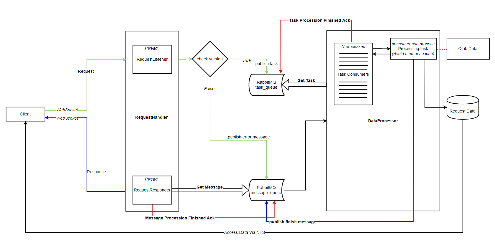

`Qlib-Server` is the data server system for [`Qlib`](https://github.com/microsoft/qlib). It enable `Qlib` to run in `online` mode. Under online mode, the data will be deployed as a shared data service. The data and their cache will be shared by all the clients. The data retrieval performance is expected to be improved due to a higher rate of cache hits. It will consume less disk space, too.

To sum up, `Qlib-Server` is designed to solve the following problems:

* Manage the data in a centralized way, which makes data management (including cache management, date updating) much easier.
* Reduce the amount of cache to be generated.
* Make the client light-weighted and leverage the powerful computing resources of remote server


- [Framework of qlib-server](#framework-of-qlib-server)
- [Quick start](#quick-start)
  - [Deployment](#deployment)
    - [One-click Deployment](#one-click-deployment)
    - [Step-by-Step Deployment](#step-by-step-deployment)
  - [Using Qlib in Online Mode](#using-qlib-in-online-mode)
- [More About Qlib](#more-about-qlib)
- [Contributing](#contributing)


# Framework of Qlib-Server

<div style="align: center">

</div>

The `Client/Server` framework of `Qlib` is based on `WebSocket` considering its capability of **bidirectional communication** between client and server in **async** mode.

`Qlib-Server` is based on [Flask](http://flask.pocoo.org/), which is a micro-framework for Python and here [Flask-SocketIO](https://flask-socketio.readthedocs.io) is used for websocket connection. 

# Quick start


## Deployment

### One-click Deployment

One-click deployment of `Qlib-Server` is supported, you can choose either of the following two methods for one-click deployment:

- Deployment with `docker-compose`
- Deployment in `Azure`

#### One-click Deployment with `docker-compose`

Deploy `Qlib-Server` with `docker-compose` according to the following processes:

* Install `docker`, please refer to [Docker Installation](https://docs.docker.com/engine/install).
* Install `docker-compose`, please refer to [Docker-compose Installation](https://docs.docker.com/compose/install/).
* Run the following command to deploy `Qlib-Server`:

    ```bash
      git clone https://github.com/microsoft/qlib-server
      cd qlib-server
      sudo docker-compose -f docker_support/docker-compose.yaml --env-file docker_support/docker-compose.env build
      sudo docker-compose -f docker_support/docker-compose.yaml --env-file docker_support/docker-compose.env up -d
      # Use the following command to track the log
      sudo docker-compose -f docker_support/docker-compose.yaml --env-file docker_support/docker-compose.env logs -f
    ```

#### One-click Deployment in `Azure`

Firstly, You need to have an `Azure` account to deploy `Qlib-Server` in `Azure`. Then you can deploy `Qlib-Server` in `Azure` according to the following processes:

* Install `azure-cli`, please refer to [install-azure-cli](https://docs.microsoft.com/en-us/cli/azure/install-azure-cli?view=azure-cli-latest).

* Add the `Azure` account to the configuration file `azure_conf.yaml`

    ```yaml
        sub_id: Your Subscription ID
        username: azure user name
        password: azure password
        # The resource group where the VM is located
        resource_group: Resource group name
    ```
* Execute the deployment script by running the following command:

    ```bash

        git clone https://github.com/microsoft/qlib-server
        cd qlib-server/scripts
        python azure_manager.py create_qlib_cs_vm \
            --qlib_server_name test_server01 \
            --qlib_client_names test_client01 \
            --admin_username test_user \
            --ssh_key_value ~/.ssh/id_rsa.pub \
            --size standard_NV6_Promo\
            --conf_path azure_conf.yaml
    ```

To know more about one-click Deployment, please refer to [Qlib-Server One-click Deployment](https://qlib-server.readthedocs.io/en/latest/build.html#one-click-deployment).

### Step-by-step Deployment

To know more about step-by-step Deployment, please refer to [Qlib-Server Step-by-step Deplyment]https://qlib-server.readthedocs.io/en/latest/build.html#step-by-step-deployment).


## Using `Qlib` in `Online` Mode

In the [Qlib Document](https://qlib.readthedocs.io/en/latest), the `Offline` mode has been introduced. 

With `Qlib-Server`, you can use `Qlib` in `Online` mode, please initialize `Qlib` with the following code:

```python
import qlib
ONLINE_CONFIG = {
    # data provider config
    "calendar_provider": {"class": "LocalCalendarProvider", "kwargs": {"remote": True}},
    "instrument_provider": "ClientInstrumentProvider",
    "feature_provider": {"class": "LocalFeatureProvider", "kwargs": {"remote": True}},
    "expression_provider": "LocalExpressionProvider",
    "dataset_provider": "ClientDatasetProvider",
    "provider": "ClientProvider",
    # config it in user's own code
    "provider_uri": "127.0.0.1:/",
    # cache
    # Using parameter 'remote' to announce the client is using server_cache, and the writing access will be disabled.
    "expression_cache": None,
    "dataset_cache": None,
    "calendar_cache": None,
    "mount_path": "/data/stock_data/qlib_data",
    "auto_mount": True,  # The nfs is already mounted on our server[auto_mount: False].
    "flask_server": "127.0.0.1",
    "flask_port": 9710,
    "region": "cn",
}

qlib.init(**client_config)
ins = D.list_instruments(D.instrumetns("all"), as_list=True)

```

For more details, please refer to [Qlib-Server Client](https://qlib-server.readthedocs.io/en/latest/client.html).

# More About Qlib-Server

The detailed documents are organized in docs. Sphinx and the readthedocs theme is required to build the documentation in html formats.

```bash
cd docs/
conda install sphinx sphinx_rtd_theme -y
# Otherwise, you can install them with pip
# pip install sphinx sphinx_rtd_theme
make html
```

You can also view the [latest document](https://qlib-server.readthedocs.io/en/latest/) online directly.

# Contributing

This project welcomes contributions and suggestions.  Most contributions require you to agree to a
Contributor License Agreement (CLA) declaring that you have the right to, and actually do, grant us
the rights to use your contribution. For details, visit https://cla.opensource.microsoft.com.

When you submit a pull request, a CLA bot will automatically determine whether you need to provide
a CLA and decorate the PR appropriately (e.g., status check, comment). Simply follow the instructions
provided by the bot. You will only need to do this once across all repos using our CLA.

This project has adopted the [Microsoft Open Source Code of Conduct](https://opensource.microsoft.com/codeofconduct/).
For more information see the [Code of Conduct FAQ](https://opensource.microsoft.com/codeofconduct/faq/) or
contact [opencode@microsoft.com](mailto:opencode@microsoft.com) with any additional questions or comments.
